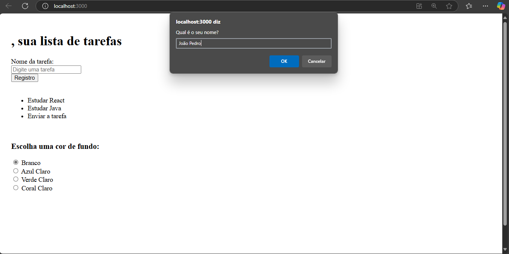
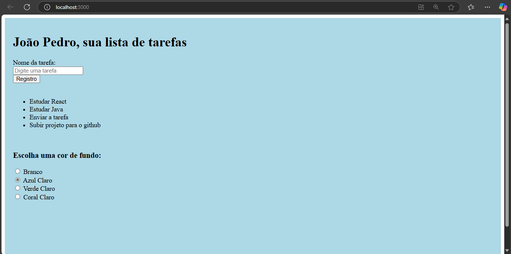

# 📝 React Task Manager

## 🚀 About the Project
React Task Manager is a simple task management application developed with React.js. It allows users to manage their daily tasks dynamically, store user preferences, and interact with a user-friendly UI. The project implements fundamental React concepts such as state management, componentization, and the use of hooks.

Key Features:

- Task Management: Add, view, and manage a list of tasks.
- Dynamic UI: Uses React hooks (useState, useEffect) for state management.
- Local Storage Support: Saves user name and preferences locally to persist data across sessions.
- Theme Customization: Allows users to select different background colors.
- Component-Based Architecture: Ensures clean and maintainable code.

The primary goal of React Task Manager is to provide a structured learning example for React beginners while offering a functional and customizable task manager.

## 🛠 Technologies Used
- Language: JavaScript
- Framework: React.js
- State Management: useState, useEffect
- UI & Design: JSX & CSS
- Component Architecture: Functional components
- Local Storage: Stores user preferences

## 📋 Requirements
- Platform: Web Browser (Chrome, Firefox, Edge, Safari)
- Tools: Node.js (v14+ recommended), npm or yarn
- Editor: Recommended: VS Code

## 📥 Installation and Execution

Clone the repository:
```sh
git clone https://github.com/seu-usuario/React-Task-Manager.git
```

Open the project:
```sh
cd React-Task-Manager
```

Install dependencies:
```sh
npm install
```

Run the app locally:
```sh
npm start
```

The app will run on http://localhost:3000.

## 🗄️ Local Storage Usage
The application makes use of Local Storage to store user information and preferences, ensuring that data persists across sessions.

- User Name Persistence: Upon the first visit, the app prompts the user for their name and saves it to local storage.
- Theme Preferences: The selected background color is stored so that the user's theme preference remains even after refreshing the page.

Example of Local Storage Implementation:



## 🖼️ Screenshots





## 🎯 Learning Objectives
During the development of React Task Manager, several technical concepts were implemented and enhanced, including:

- React Hooks: Managing state and side effects with useState and useEffect.
- Component-Based UI: Creating reusable components to structure the application.
- Local Storage Integration: Storing user preferences for a persistent experience.
- Dynamic Rendering: Updating UI based on user actions.
- Event Handling: Capturing user inputs and managing form submissions.

Developed to serve as a structured learning tool for those beginning with React.js.
